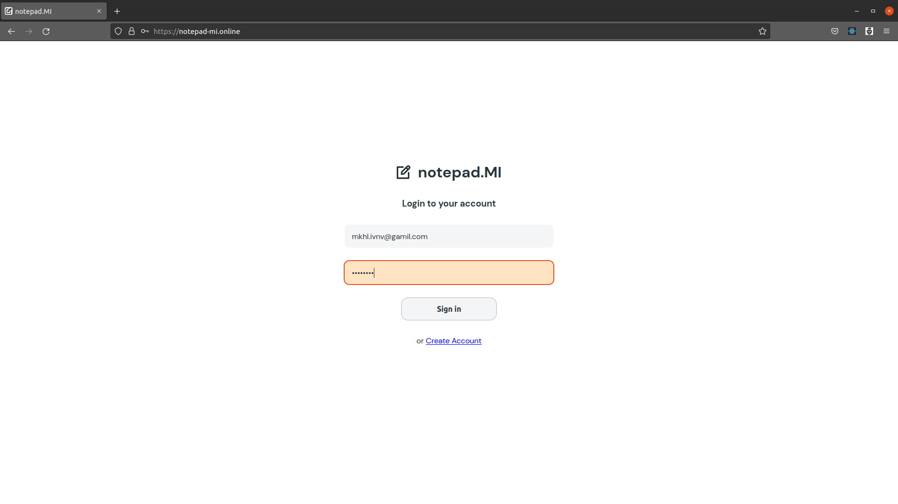
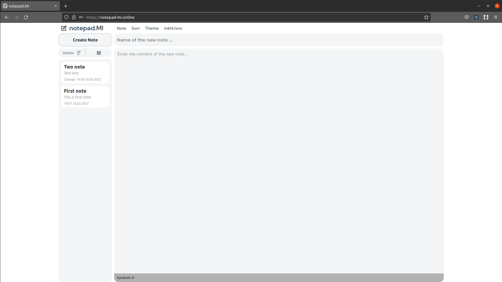
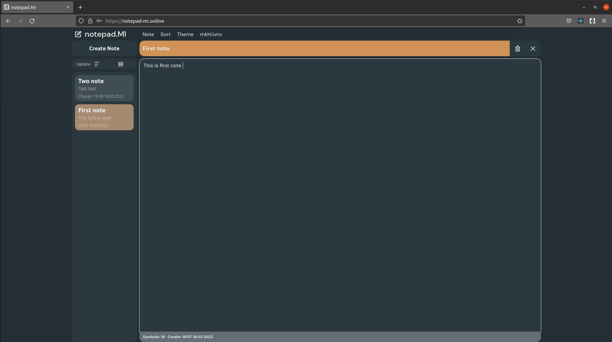
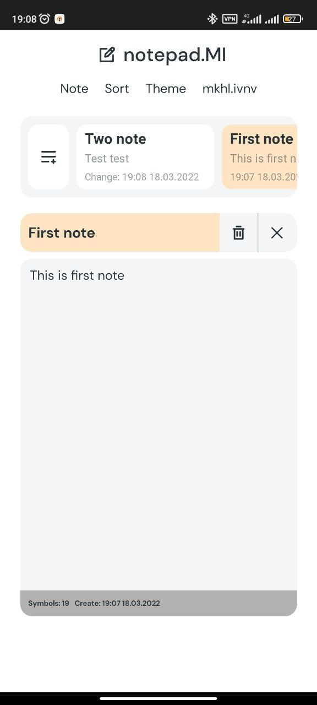
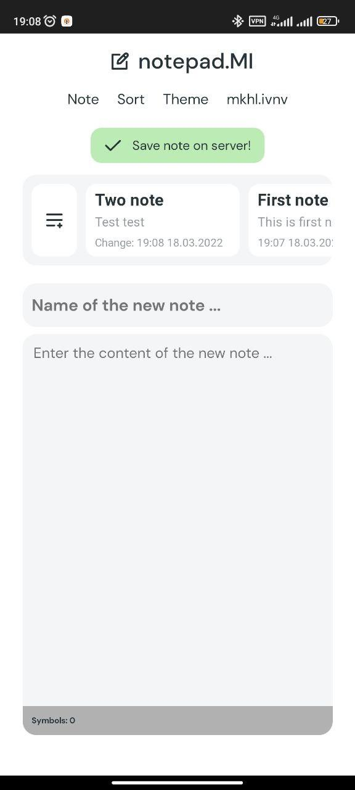

# notepad.MI

This is a WEB application project with support for PWA technology.

The project was developed using technologies: JavaScript, React, Redux, Firebase, SCSS.

At the moment, the project is under development, so the current commits may be with errors))

The current version of the application can be viewed on the domain: [notepad-mi.online](https://www.notepad-mi.online)

Screenshots:

